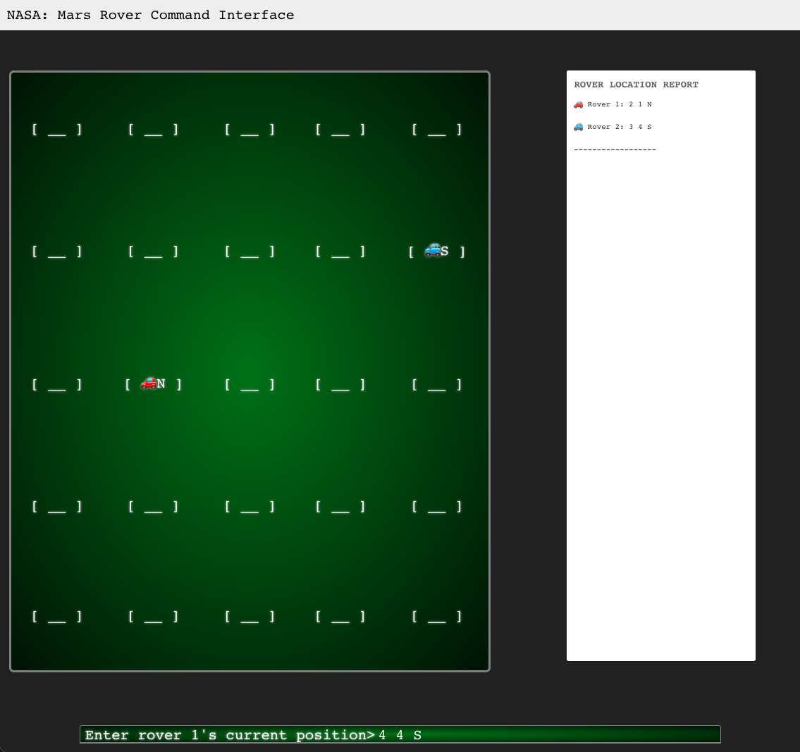

Nasa-Rover-Simulator
======================================

## Summary
This is my implementation of the NASA Rover Problem. I had a ton of fun with it and hope to be able to discuss it with the team in the next interview.

## Approach
Although I have never used Vue before, I decided to take on the challenge of building this solution in Vue. I've always wanted to learn it but just haven't had the time. I figured this coding challenge would be a great way to not only learn Vue while I was completing the challenge, but provide me with a good project for my Github. While my solution definately isn't the most refined, I had a ton of fun building the project and learned so much about Vue as a whole.

Initially I built an MVP and once I had that in place, I utilized the Vuetify library to make the UI look a bit better along with some custom CSS to further style things to my liking. I followed [this](https://css-tricks.com/old-timey-terminal-styling/) to create the styling for the table view and the idea was that it would be similar to an old CRT screen with a command line open (I imagine everything at NASA is running on legacy code ha!).

## Getting started

```bash
# clone the project
git clone https://github.com/MasonKomo/Nasa-Rover-Simulator.git

# enter the project directory
cd Nasa-Rover-Simulator/nasa-rover/

# install dependency
npm install

# develop
npm run serve
```

This will run the app at http://localhost:8080/

## Issues
As I was doing my final testing (and running way behind on time), I found a few bugs that I wish I could have fixed:
- Moving one rover over a position that was previously occupied by the other rover causes an error.
- Input field doesn't clear on each new prompt. 
- Need to auto conver intsructions to upper.
- Depending on screen size, there is a limit to the possible grid size. I did most testing at 5x5 but beyond 15x15 seems to break.
- Would like to add instructions or error prompts that aren't alerts... tool tips would be nice.
I wish I could have fixed these things but my wife was getting really mad at me for working on this thing late 😬!

